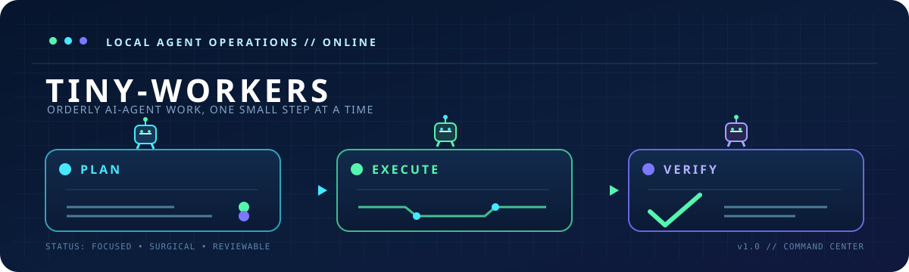

<p align="center">
  
</p>

<h1 align="center">Tiny-Workers</h1>

<p align="center">A collection of workflow skills that keep AI agents focused, orderly, and on track.</p>

<p align="center">
  <a href="https://www.npmjs.com/package/@hoangthai2171/tiny-workers">
    
  </a>
</p>

Tiny-Workers gives AI agents a practical workflow for staying focused and keeping project work orderly. It was designed to make AI-agent development predictable: clarify first, plan explicitly, execute narrowly, verify honestly, and keep the user in control of material decisions.

## Workflow

Tiny-Workers separates project control from planning and implementation:

- **Tiny-PM** manages scope, approvals, risk, milestones, and handoff.
- **Tiny-Planner** investigates the repository and writes an approval-ready implementation plan.
- **Tiny-Executor** executes an approved plan, verifies each milestone, and records evidence.
- **Tiny-Workers** dispatches the correct phase in that order.

The normal lifecycle is:

`Tiny-Workers → Tiny-PM → Tiny-Planner → approval → Tiny-Executor → verified handoff`

## Supported agents

Tiny-Workers supports Codex, Claude Code, Antigravity, OpenCode, and Hermes Agent.

## Install

You do not need to clone this repository. Tiny-Workers is a public package on npmjs.org, so no registry configuration or login is needed:

```sh
npx @hoangthai2171/tiny-workers
```

Select one or more numbered agents, for example `1,3,5`. The installer places `tiny-pm/`, `tiny-planner/`, `tiny-executor/`, and `tiny-workers/` directly in each selected agent's global skills directory.

## Usage

```sh
$tiny-workers
```

Call this at the start of a session to apply the Tiny-Workers workflow.

## Tiny-PM workflow criteria

Tiny-PM's practical value is a focused, reviewable workflow that:

- Defines a clear, observable goal before work begins
- Keeps changes focused, surgical, and easy to review
- Makes assumptions, trade-offs, and uncertainty visible
- Uses explicit approval boundaries for risky or high-impact work
- Tracks multi-step work with milestone checkpoints
- Verifies the requested outcome before claiming completion

## Update

```sh
npx @hoangthai2171/tiny-workers update
```

The command displays detected agents and asks before replacing either existing Tiny-Workers skill folder.

## Uninstall

```sh
npx @hoangthai2171/tiny-workers uninstall
```

After confirmation, this removes only the selected agents' `tiny-pm/`, `tiny-planner/`, `tiny-executor/`, and `tiny-workers/` folders.

## License

MIT © 2026 Hoang Thai. See [LICENSE](./LICENSE).
