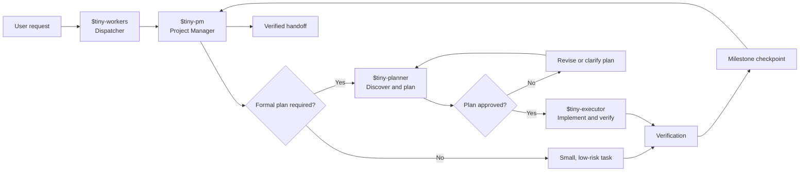
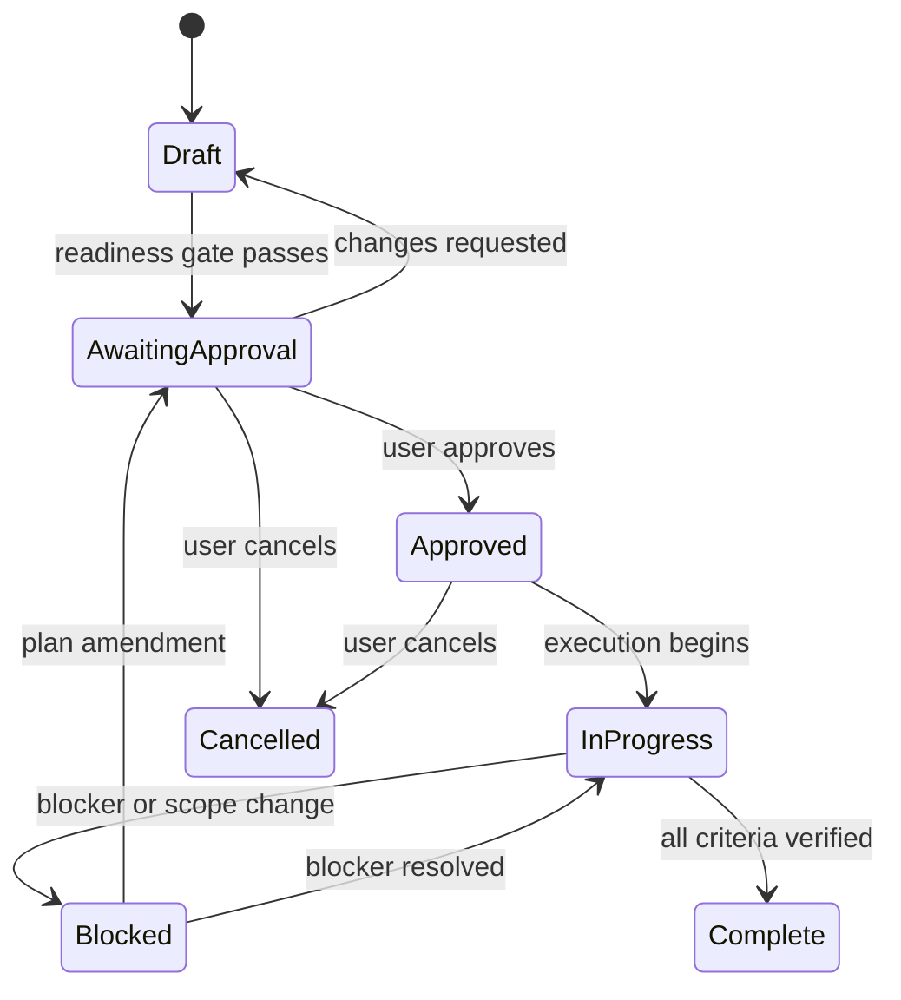

# Tiny-Workers

## A disciplined workflow for AI-agent software development

> **Version:** 0.2.0  
> **Audience:** Software teams, AI-agent users, and project maintainers  
> **Purpose:** Explain how Tiny-Workers turns a feature request into an approved, implemented, and verified change.

Tiny-Workers is a coordinated collection of workflow skills for AI coding agents. It gives each phase of software work a clear responsibility:

- **Tiny-PM** manages the project, authority, risk, approvals, milestones, and handoff.
- **Tiny-Planner** investigates the repository and produces an approval-ready implementation plan.
- **Tiny-Executor** implements an approved plan and records evidence from each milestone.
- **Tiny-Workers** dispatches the correct phase and keeps Tiny-PM in control.

The result is a workflow that is easier to review, safer to resume, and more honest about what has—or has not—been verified.

## The operating model



The normal lifecycle is:

```text
Tiny-Workers → Tiny-PM → Tiny-Planner → approval → Tiny-Executor → verified handoff
```

Tiny-Workers is not an independent project manager. It is the dispatcher. Tiny-PM remains the control plane throughout the work.

## The four responsibilities

| Component | Primary responsibility | Must not do |
|---|---|---|
| **Tiny-Workers** | Route the request into the correct Tiny-Workers phase. | Bypass Tiny-PM or implement work directly. |
| **Tiny-PM** | Manage scope, authority, risk, approvals, sequencing, milestones, and completion. | Silently make material product or architecture decisions. |
| **Tiny-Planner** | Inspect the project, resolve requirements, document decisions, and write the implementation plan. | Edit implementation files or claim that the plan is approved. |
| **Tiny-Executor** | Execute approved steps, run checks, update evidence, and report deviations. | Invent a plan, expand scope, or bypass approval gates. |

This separation prevents two common failures: an agent implementing before the requirements are understood, and an agent claiming success without evidence.

## Starting a session

The user starts the workflow by invoking Tiny-Workers:

```text
$tiny-workers
```

Tiny-Workers immediately routes control to Tiny-PM. Tiny-PM then asks for a milestone-level authorization:

> Do you authorize me to complete minor, low-risk tasks in this milestone without requesting further approval?
>
> 1. Yes  
> 2. No

### What “Yes” means

Choosing **Yes** allows routine, reversible work such as:

- Inspecting files and project history.
- Running tests, lint, type checks, or builds.
- Making focused fixes within the approved scope.
- Updating imports or small helpers.
- Updating documentation related to the change.

### What “Yes” does not mean

The authorization does not approve:

- Authentication or authorization changes.
- Payment behavior.
- Production deployment.
- Credentials or secrets.
- Database migrations or destructive actions.
- New external services.
- Major architecture or public API changes.
- Unplanned files, subsystems, or scope.

These actions require explicit approval even when minor-task authorization was granted.

Authorization is limited to the current work session or milestone. It is not a permanent permission and does not automatically carry across a new plan or a new risk boundary.

## Triage: does the request need a plan?

Tiny-PM first translates the request into an observable outcome and decides whether a formal plan is required.

### A formal plan is required when the work:

- Has multiple implementation steps.
- Touches multiple files or subsystems.
- Changes public behavior, data, APIs, or authentication.
- Has meaningful security, operational, or production risk.
- Requires coordination or a handoff to another agent.
- Needs to be resumed later.

### A formal plan may be unnecessary when the work is:

- A single, clear, low-risk change.
- Reversible and easy to verify.
- Fully described by the request.
- Unlikely to affect other components.

When a material answer is missing, Tiny-PM asks a focused question before planning. It should not hide important ambiguity inside a plan.

## Planning with Tiny-Planner

When a formal plan is required, Tiny-PM invokes Tiny-Planner.

Tiny-Planner works in six stages:

1. **Establish the outcome** — define the problem, desired result, acceptance criteria, and non-goals.
2. **Inspect the project** — read relevant code, docs, tests, instructions, history, and current workspace state.
3. **Define scope and decisions** — identify affected files, alternatives, dependencies, risks, and compatibility constraints.
4. **Write the plan** — save it under `docs/tinyworkers/<PLAN_NAME>_<TIMESTAMP>.md`.
5. **Run the readiness gate** — check that the plan is complete, testable, evidence-based, and free of material placeholders.
6. **Hand off for approval** — mark the plan `Awaiting approval` and return it to Tiny-PM.

A plan is not just a task list. It is an execution contract containing:

- Goal and acceptance criteria.
- Explicit scope and non-goals.
- Current-state findings and baseline results.
- Findings, decisions, assumptions, constraints, and dependencies.
- A file-by-file impact map.
- Ordered implementation milestones.
- Per-step exit criteria and verification commands.
- Risks and rollback or recovery strategy.
- A completed-verification section for actual results.

Tiny-Planner may recommend that a plan is ready, but Tiny-PM owns the final readiness and approval decision.

## Plan approval

Once the plan is ready, Tiny-PM presents the important scope and risks and asks for approval:

> The plan is ready for review. It changes `<affected area>` and includes `<key risks or dependencies>`.
>
> 1. Approve the plan and authorize implementation.  
> 2. Request changes to the plan.  
> 3. Cancel the work.

The plan moves through these states:



The plan's status block is the source of truth:

```md
**Status:** In progress

- [x] Step 1: Completed milestone
- [ ] Step 2: Current milestone
- [ ] Step 3: Pending milestone
```

## Executing with Tiny-Executor

Tiny-Executor can start only when the plan is `Approved` or already `In progress`.

### Executor preflight

Before editing, Tiny-Executor confirms:

- The plan is the canonical plan for the request.
- Material questions are resolved.
- The workspace, branch, and existing changes are understood.
- The required authorizations are present.
- Baseline checks and pre-existing failures are recorded.

It never resets or discards unrelated user changes to make the workspace appear clean.

### The milestone loop

For each numbered plan step, Tiny-Executor:

1. Selects the first incomplete step.
2. Marks it `In progress`.
3. Rereads the current source around the planned symbols or sections.
4. Makes only the planned changes.
5. Runs the step-specific verification.
6. Records the actual command, result, and evidence.
7. Marks the step `Complete`, `Blocked`, or `Failed`.
8. Updates the plan status block immediately.
9. Stops at the milestone checkpoint.

At the checkpoint, Tiny-PM reports:

> Step `<N>` is complete.  
> Evidence: `<tests, commands, or artifacts>`.  
> Next step: `<next milestone>`.  
> Additional approval: `<required or not required>`.

The agent does not silently run every remaining step when a checkpoint or risk boundary requires review.

## Scope and change control

Small implementation adaptations are allowed when they preserve the approved:

- Outcome.
- Files.
- Acceptance criteria.
- Risk level.
- Public behavior.

The adaptation must be recorded in the plan's deviation log.

Tiny-PM requires a plan amendment and approval when the work would:

- Add, delete, or rename an unplanned file or subsystem.
- Change an API, data model, migration, architecture, or acceptance criterion.
- Introduce credentials, deployment, production work, or external coordination.
- Change the risk classification.
- Make the approved approach technically invalid.

Example question:

> The application does not have an email provider, but the approved password-reset plan assumes one. Adding a provider requires a new dependency and production credentials.
>
> 1. Amend the plan to add an email provider.  
> 2. Use an existing provider abstraction.  
> 3. Pause the feature until the provider is decided.

The executor must stop rather than silently choose.

## Verification and completion

Completion requires evidence, not confidence.

Before Tiny-PM marks a plan `Complete`, it confirms:

- Every acceptance criterion has actual evidence.
- Every milestone is complete or explicitly accepted as skipped.
- Relevant unit, integration, regression, negative, static, and manual checks ran.
- The final diff contains no unrelated changes.
- Known failures and limitations are visible.
- Deviations are documented.
- The plan status and completed-verification sections are current.

The final handoff includes:

- Changed files.
- Tests and checks passed.
- Known limitations.
- Unresolved issues.
- Follow-up work.
- Any remaining approval or deployment decision.

## Example: adding password reset

Password reset is a useful example because it demonstrates both normal execution and risk boundaries.

### Example flow

1. The user asks Tiny-Workers to add password reset.
2. Tiny-PM classifies it as a multi-step authentication change.
3. Tiny-PM asks any material product questions, such as whether to use an emailed link or a numeric code.
4. Tiny-Planner inspects the existing authentication, email, session, database, and test systems.
5. Tiny-Planner writes a plan covering token generation, expiry, single-use behavior, email delivery, password replacement, session invalidation, and security tests.
6. Tiny-PM asks the user to approve the plan because authentication behavior is high impact.
7. Tiny-Executor implements one milestone at a time.
8. Each milestone is verified and recorded before the next one begins.
9. If adding an email provider or production secret becomes necessary, Tiny-PM asks for separate explicit approval.
10. Tiny-PM accepts completion only after the acceptance criteria and security checks have evidence.

### Example acceptance criteria

- A user can request a reset link.
- Known and unknown email addresses receive indistinguishable responses.
- Reset tokens are protected at rest.
- Tokens expire after the planned duration.
- Tokens can be used only once.
- Invalid and expired tokens are rejected.
- The new password satisfies the password policy.
- Existing sessions are invalidated after a successful reset.
- The new password works and the old password no longer works.

The initial minor-task authorization does not replace approval for this authentication change.

## How failures are handled

When a check fails, Tiny-Executor classifies the failure before acting:

| Failure type | Response |
|---|---|
| Caused by the current change and within scope | Repair, rerun the check, and record the result. |
| Pre-existing | Record the evidence and ask Tiny-PM whether work may continue. |
| Unrelated | Do not silently fix it; record it and keep scope focused. |
| Repeated, ambiguous, or scope-expanding | Mark the step `Blocked` or `Failed` and stop. |

This makes it possible to distinguish “the feature is broken” from “the repository already had a failure.”

## Artifacts and source of truth

The plan document is the shared project artifact. During the workflow it contains:

- Current plan status.
- Step checkboxes.
- File impact and decisions.
- Planned verification.
- Completed verification.
- Deviations and approved changes.
- Final handoff information.

The agent's final message is a summary. The plan document is the durable record that another agent or person can resume later.

## Quick reference

```text
1. Invoke $tiny-workers.
2. Tiny-PM asks for minor-task authorization.
3. Describe the feature.
4. Tiny-PM triages scope and risk.
5. Tiny-Planner investigates and writes the plan.
6. Tiny-PM reviews and requests plan approval.
7. Tiny-Executor runs approved milestones.
8. Each milestone records real verification evidence.
9. Scope changes pause for approval.
10. Tiny-PM completes the handoff only after all criteria are verified.
```

Tiny-Workers is designed to make AI-agent development predictable: clarify first, plan explicitly, execute narrowly, verify honestly, and keep the user in control of material decisions.
